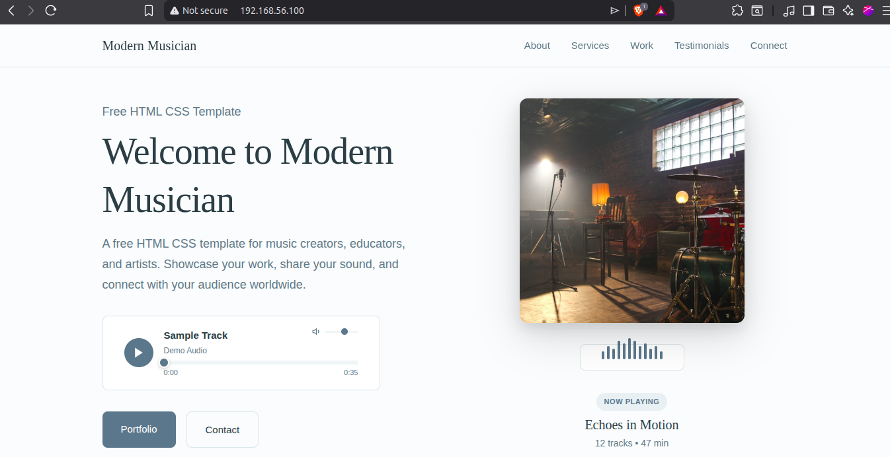

# A static website hosting script

websetup.sh bash script combines all the commands used to host an Apache http server on vm "scriptbox" that we created using Vagrantfile. 

The steps:
1. We install necessary packages in the vm: httpd, unzip, wget
2. we enable httpd service
3. we download zip file for static website. In my case, I have downloaded modern musician website's zip file as temporary file which we'll delete after extracting.
4. we extract and copy in /var/www/html/ directory which is root directory for Apache http server.
5. We restart httpd service
6. We perform necessary cleanup.

The result of website is: 

