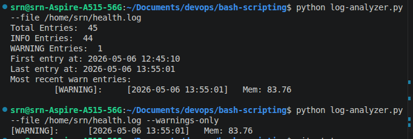

I wrote a script health_check.sh that checks:

1. CPU usage
2. Memory usage
3. Number of running processes
4. System uptime
5. Load average
6. Network Connectivity
7. Top 3 highest CPU consuming processes
8. TOP 3 highest memory consuming processes
9. Disk Usage in percentage

And it logs everything to health.log file.

I have turned it into a cron job which runs every 5 minutes as:

\*/5 \* \* \* \* /path/to/health_check.sh >> /path/to/health.log 2>&1

It means run this script every minutes divisible by 5, redirect output to health.log file and also redirect input to stderr to stdout i.e. health.log file. 

I also wrote log-analyzer.py python file that analyzes the health.log file or in fact any log files and prints log analysis summary. 

To run log-analyzer:
```
python log-analyzer.py --file /path/to/health.log 
```

Another simple functionality is only showing warning logs:
```
python log-analyzer.py --file /path/to/health.log --warnings-only
```

## Sample Output:

